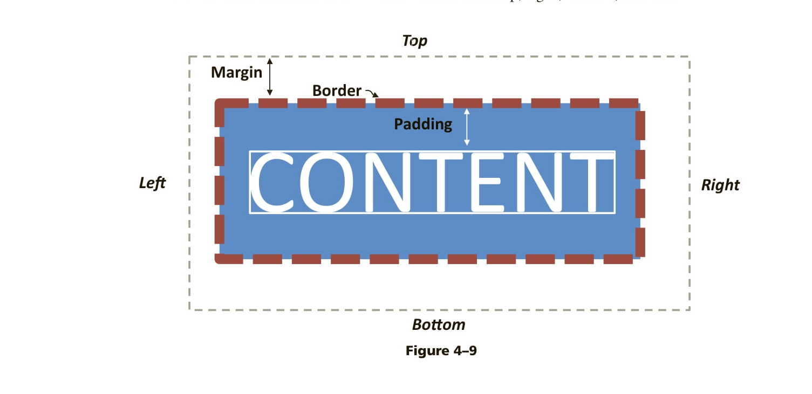

# Posts-Update-Project
Absolutely! Let's break this down step by step, focusing on the user's actions, the code's response, and the logic behind each line.

### Scenario:
Imagine you have a list of tasks on a webpage. Each task has an "Edit" button next to it. When you click on the "Edit" button, the task's text appears in an input box, allowing you to modify it. Once you've made your changes, you can submit the form to update the task.

### User Action and Code Response:

1. **User clicks the "Edit" button for a specific task**:
    - When you set up the "Edit" button in the HTML, you likely added an `onClick` attribute to it, which calls the `startEdit` function and passes the index of the task as an argument. This index is the position of the task in the `data` array.
    - Example: `<button onClick="startEdit(1)">Edit</button>` (for the second task in the list)

2. **startEdit function is triggered**:
    ```javascript
    function startEdit(index) {
        editIndex = index;
        input.value = data[index].text;
    }
    ```
    - `editIndex = index;`: This line stores the index (position) of the task you want to edit. It's like bookmarking a page in a book so you can quickly return to it later.
    - `input.value = data[index].text;`: This line takes the text of the task you want to edit and places it in the input box. It's like copying the text from the bookmarked page and pasting it into a notepad for editing.

3. **User modifies the task in the input box and submits the form**:
    - You change the task text in the input box. This action doesn't trigger any code yet; you're just typing in a box.

4. **updatePost function is triggered upon form submission**:
    ```javascript
    function updatePost() {
        data[editIndex].text = input.value;
        editIndex = null;
    }
    ```
    - `data[editIndex].text = input.value;`: This line updates the task in the `data` array with the new text you typed in the input box. It's like erasing the old text on the bookmarked page and writing the new text in its place.
    - `editIndex = null;`: This line clears the bookmark. It indicates that you're done editing, and there's no current task being edited.

### Logic and Reason:

- **Why use `editIndex`?**: Without `editIndex`, we wouldn't know which task in the `data` array to update. It serves as a temporary marker to remember which task is being edited.
  
- **Why `input.value = data[index].text;`?**: This line is essential for user experience. When you click "Edit", you expect to see the current text of the task in the input box, ready for modification. This line ensures that happens.

- **Why `data[editIndex].text = input.value;`?**: After editing, you expect your changes to be saved. This line updates the original task with your new text.

### Analogy:
Think of the `data` array as a bookshelf, where each book represents a task. The `editIndex` is like a bookmark. When you decide to edit a book (task), you place the bookmark in it. When you're done editing, you update the book's content and then remove the bookmark.

In this scenario, the act of placing the bookmark is the `startEdit` function, and the act of updating the book and removing the bookmark is the `updatePost` function. The input box is like a notepad where you draft your changes before finalizing them in the book.


## 

Certainly! Let's add an edit function and a toggle function to the existing JavaScript code, and then I'll provide a React version for comparison.

**Updated JavaScript Code with Edit and Toggle:**

```javascript
const postList = document.getElementById('post-list');
const addPostButton = document.getElementById('add-post-button');
let posts = [];

// Function to display posts in the postList element.
function displayPosts() {
  postList.innerHTML = ''; // Clear the existing content.

  // Loop through the posts array and add each post to the postList.
  posts.forEach((postText, index) => {
    const postDiv = document.createElement('div');
    postDiv.innerHTML = `
      <p>${postText}</p>
      <button onclick="editPost(${index})">Edit</button>
      <button onclick="deletePost(${index})">Delete</button>
      <button onclick="togglePost(${index})">Toggle</button>
    `;
    postList.appendChild(postDiv);
  });
}

// Function to add a new post to the posts array and refresh the display.
function addPost() {
  const newPost = prompt('Enter a new post:');
  if (newPost) {
    posts.push(newPost);
    displayPosts();
  }
}

// Function to edit a post in the posts array and refresh the display.
function editPost(index) {
  const updatedPost = prompt('Edit the post:', posts[index]);
  if (updatedPost !== null) {
    posts[index] = updatedPost;
    displayPosts();
  }
}

// Function to toggle a post (add or remove) from the posts array and refresh the display.
function togglePost(index) {
  posts.splice(index, 1); // Remove the post at the given index.
  displayPosts();
}

// Function to delete a post from the posts array and refresh the display.
function deletePost(index) {
  posts.splice(index, 1);
  displayPosts();
}

// Attach event listeners.
addPostButton.addEventListener('click', addPost);

// Initial display of posts.
displayPosts();
```

In this updated code:

- We've added an "Edit" button next to each post that allows users to edit the post's text.
- We've added a "Toggle" button that allows users to toggle (add or remove) a post.

Now, let's create a React version of the same functionality:

**React Code for Posts List:**

```jsx
import React, { useState } from 'react';

function PostsList() {
  const [posts, setPosts] = useState([]);
  const [newPost, setNewPost] = useState('');

  const addPost = () => {
    if (newPost) {
      setPosts([...posts, newPost]);
      setNewPost('');
    }
  };

  const editPost = (index) => {
    const updatedPost = prompt('Edit the post:', posts[index]);
    if (updatedPost !== null) {
      const updatedPosts = [...posts];
      updatedPosts[index] = updatedPost;
      setPosts(updatedPosts);
    }
  };

  const togglePost = (index) => {
    const updatedPosts = [...posts];
    updatedPosts.splice(index, 1);
    setPosts(updatedPosts);
  };

  return (
    <div>
      <input
        type="text"
        placeholder="Enter a new post"
        value={newPost}
        onChange={(e) => setNewPost(e.target.value)}
      />
      <button onClick={addPost}>Add Post</button>
      <div id="post-list">
        {posts.map((post, index) => (
          <div key={index}>
            <p>{post}</p>
            <button onClick={() => editPost(index)}>Edit</button>
            <button onClick={() => togglePost(index)}>Toggle</button>
            <button onClick={() => togglePost(index)}>Delete</button>
          </div>
        ))}
      </div>
    </div>
  );
}

export default PostsList;
```

In the React version:

- We're using the `useState` hook to manage the state of the `posts` array and the `newPost` input field.
- We have functions for adding, editing, and toggling posts, which update the state using `setPosts`.
- The JSX code renders the list of posts and buttons, and it handles user interactions using React event handlers.

Comparing the two approaches:

- In the JavaScript (non-React) version, we manually manipulate the DOM using `innerHTML` and attach event listeners to HTML elements.
- In the React version, we manage state using hooks (`useState`) and use JSX to define the UI. React handles the rendering and updating of the UI based on state changes.

The React version provides a more declarative and structured way to manage state and UI interactions, making it easier to understand and maintain complex UIs.

